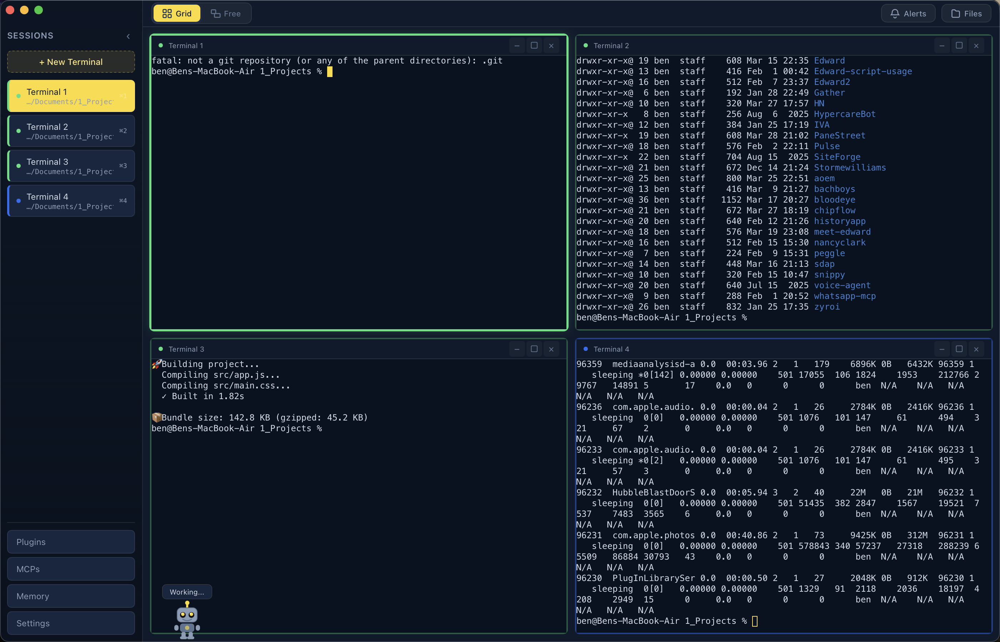
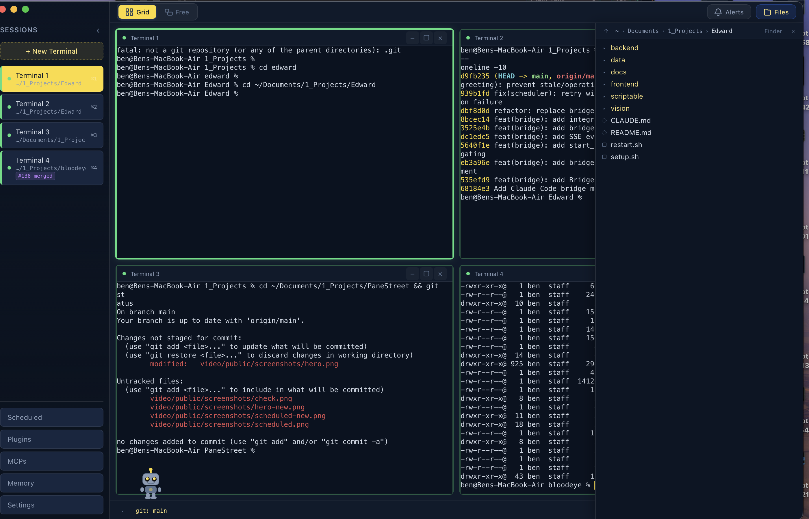
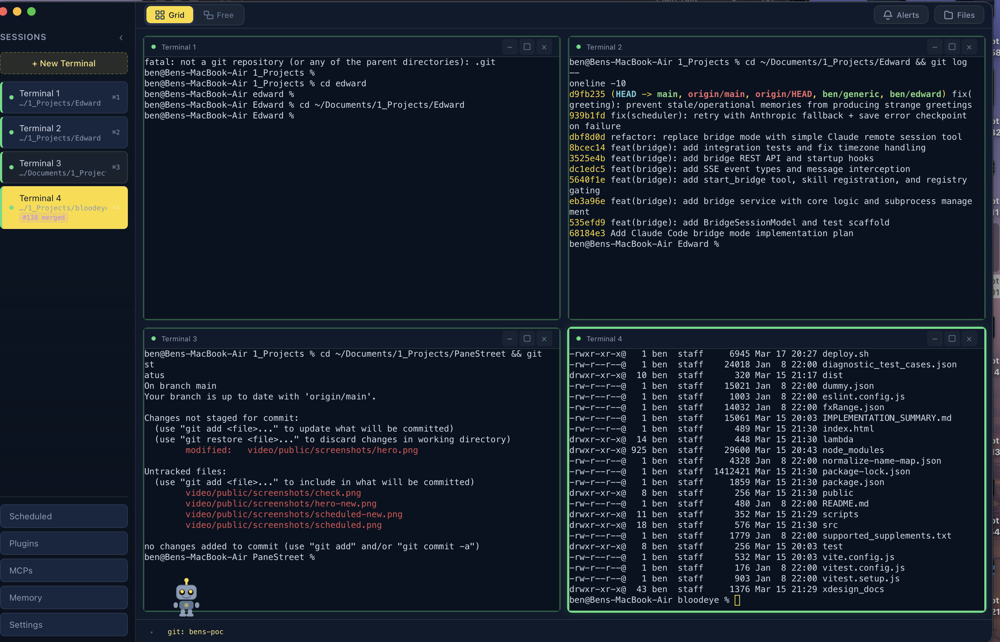
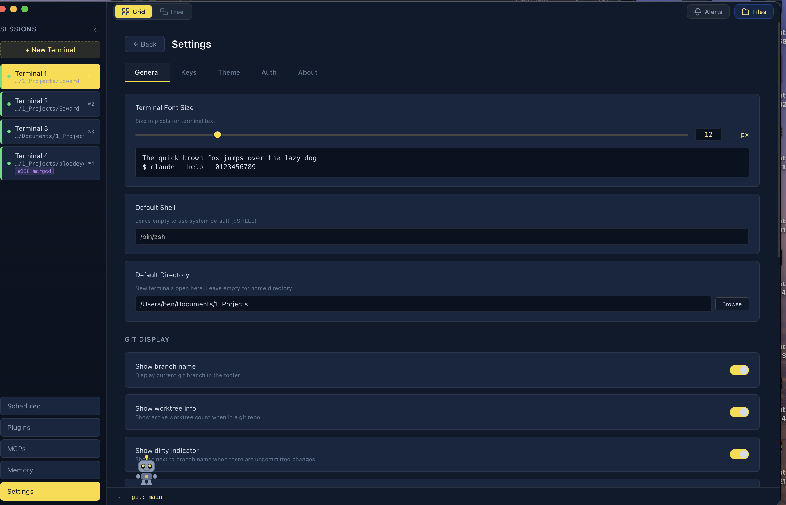
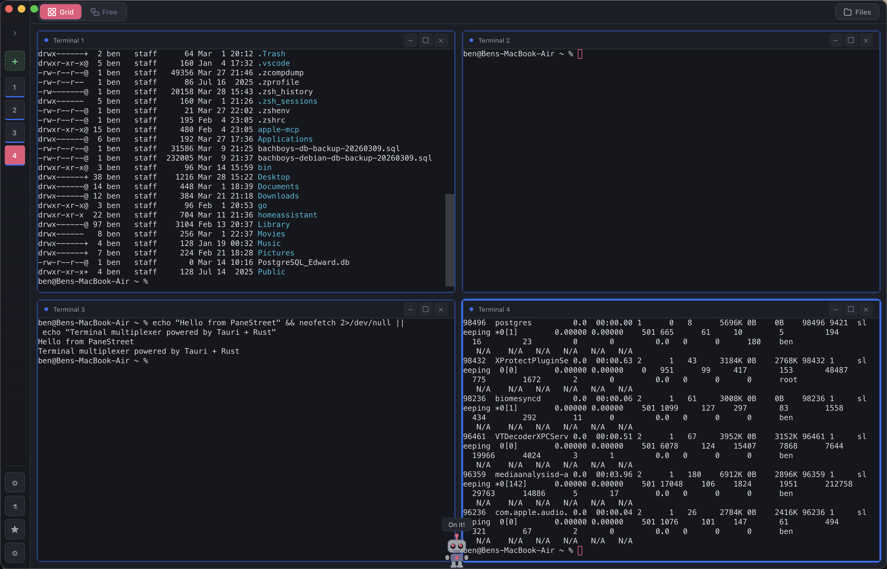

<p align="center">
  
</p>

<h1 align="center">PaneStreet</h1>

<p align="center">
  <strong>A modern terminal multiplexer for macOS, Windows, and Linux</strong><br>
  Built with Tauri, Rust, and xterm.js — with Claude AI integration baked in.
</p>

<p align="center">
  <a href="https://github.com/ben4mn/PaneStreet/releases/latest"></a>
  <a href="LICENSE"></a>
  <a href="https://github.com/ben4mn/PaneStreet/stargazers"></a>
  
  
</p>

<p align="center">
  <a href="https://ben4mn.github.io/PaneStreet/">Website</a> •
  <a href="https://github.com/ben4mn/PaneStreet/releases/latest">Download</a> •
  <a href="#features">Features</a> •
  <a href="#installation">Installation</a> •
  <a href="#keyboard-shortcuts">Shortcuts</a>
</p>

---

<p align="center">
  
</p>

## Why PaneStreet?

Terminal multiplexers like tmux are powerful but stuck in the 80s. PaneStreet brings multi-pane terminal management into a native desktop app with GPU-accelerated rendering, drag-and-drop window management, 16 built-in themes, and deep integration with Claude AI tools.

No config files. No arcane keybindings to memorize. Just open it and start working.

## Features

### Terminal Management
- **Multi-pane layouts** — Auto-grid, freeform drag-and-drop, or edge-snap split modes
- **GPU-accelerated rendering** — Powered by xterm.js with WebGL
- **Session persistence** — Layout and scrollback history survive restarts
- **Process status detection** — Know what's running in each pane at a glance
- **Directional navigation** — Move between panes with `⌘ ⌥ Arrow` keys

### Window Management
- **Three layout modes** — Auto-grid for quick setups, freeform for full control, snap-to-edge for tiling
- **Maximize / minimize panes** — Focus on one task, restore when ready
- **Minimized pane pills** — Quick access to backgrounded terminals in the footer

### Notifications & Monitoring
- **Notification sidebar** — Slide-in panel showing terminal alerts (waiting for input, needs permission, exited)
- **Notification rings** — Pulsing glow on unfocused panes that need attention
- **Sidebar metadata** — CWD, listening ports, and PR status shown per session
- **OSC notification support** — Handles OSC 9, 99, and 777 terminal notifications
- **Native desktop notifications** — Per-status toggle with sound control

### File Browser
- **Built-in file viewer** — Browse directories without leaving the app
- **CWD tracking** — File browser follows your terminal's working directory
- **File preview** — Peek at file contents inline
- **Open in Finder** — One click to jump to the file system

### Socket API
- **Unix socket server** — Control PaneStreet from external scripts and CLI tools
- **Commands** — List sessions, write to terminals, send notifications, focus sessions
- **CLI tool included** — `cli/panestreet` script for quick terminal access

### Claude AI Integration
- **Plugin viewer** — See installed Claude plugins with version and scope info
- **MCP browser** — View configured Model Context Protocol servers
- **Memory inspector** — Browse project-specific and global Claude memory
- **Config reader** — Reads your Claude configuration automatically

### Customization
- **16 built-in themes** — Dark, Midnight Blue, Dracula, Nord, Solarized Dark, Gruvbox Dark, Tokyo Night, One Dark, Catppuccin Mocha, Rose Pine, Kanagawa, Everforest, Synthwave 84, Ayu Dark, Horizon, Moonlight
- **Custom themes** — Full color editor for every UI and terminal color
- **Rebindable keyboard shortcuts** — Customize every shortcut with conflict detection

<p align="center">
  
</p>

## Installation

### Download (macOS)

Grab the latest `.dmg` from the [Releases page](https://github.com/ben4mn/PaneStreet/releases/latest).

> **Note:** The app is not yet code-signed. On first launch, macOS Gatekeeper will block it. To open:
> 1. Right-click the app → **Open** → click **Open** in the dialog
> 2. Or go to **System Settings → Privacy & Security** → click **Open Anyway**
>
> You only need to do this once.

### Build from Source

Requires [Node.js](https://nodejs.org/) (18+), [Rust](https://rustup.rs/), and the [Tauri CLI](https://v2.tauri.app/start/prerequisites/).

```bash
git clone https://github.com/ben4mn/PaneStreet.git
cd PaneStreet
npm install
npm run tauri build
```

The `.dmg` (macOS), `.msi` (Windows), or `.AppImage` (Linux) will be in `src-tauri/target/release/bundle/`.

### Development

```bash
npm run tauri dev
```

## Keyboard Shortcuts

All shortcuts are rebindable in **Settings → Keyboard Shortcuts**.

| Action | Default Shortcut |
|--------|-----------------|
| New Terminal | `⌘ N` |
| Close Terminal | `⌘ W` |
| Settings | `⌘ ,` |
| Toggle Sidebar | `⌘ B` |
| File Browser | `⇧ ⌘ E` |
| Maximize Pane | `⇧ ⌘ Enter` |
| Minimize Pane | `⌘ M` |
| Restore All | `⇧ ⌘ M` |
| Toggle Layout Mode | `⇧ ⌘ G` |
| Previous Pane | `⇧ ⌘ [` |
| Next Pane | `⇧ ⌘ ]` |
| Navigate Up/Down/Left/Right | `⌘ ⌥ Arrow` |
| Notifications | `⌘ I` |
| Switch to Pane 1–9 | `⌘ 1` – `⌘ 9` |
| Close Panel / Overlay | `Escape` |

## Tech Stack

| Layer | Technology |
|-------|-----------|
| Framework | [Tauri 2.x](https://v2.tauri.app/) |
| Backend | Rust (tokio, portable-pty, git2, keyring) |
| Frontend | Vanilla HTML/CSS/JS |
| Terminal | [xterm.js 6.0](https://xtermjs.org/) with WebGL addon |
| Icons | Custom robot mascot + SVG terminal icon |

## Architecture

```
PaneStreet/
├── src/                    # Frontend (HTML/CSS/JS)
│   ├── index.html          # App shell
│   ├── css/main.css        # Styles + 16 theme definitions
│   └── js/
│       ├── app.js          # Core: layout engine, sessions, shortcuts
│       ├── config-panels.js # Settings, themes, plugins, MCPs, memory
│       ├── file-viewer.js  # File browser panel
│       └── terminal.js     # xterm.js session wrapper
├── src-tauri/              # Backend (Rust)
│   └── src/
│       ├── lib.rs          # Tauri command registry
│       ├── pty_manager.rs  # PTY spawning, I/O, resize
│       ├── config_reader.rs # Claude config/plugin/MCP reader
│       ├── worktree_manager.rs # Git operations
│       ├── status_detector.rs  # Process status detection
│       ├── socket_server.rs    # Unix socket API for external control
│       ├── file_viewer.rs  # Directory & file reading
│       └── auth_manager.rs # Keyring-based API key storage
├── cli/                    # CLI tool for socket API
└── docs/                   # GitHub Pages site
```

## Screenshots

<p align="center">
  
  <br><em>Built-in file browser with CWD tracking</em>
</p>

<p align="center">
  
  <br><em>Fully rebindable keyboard shortcuts with conflict detection</em>
</p>

<p align="center">
  
  <br><em>Meet the PaneStreet robot</em>
</p>

## Contributing

Contributions are welcome. Please open an issue first to discuss what you'd like to change.

1. Fork the repository
2. Create your feature branch (`git checkout -b feature/my-feature`)
3. Commit your changes (`git commit -m 'Add my feature'`)
4. Push to the branch (`git push origin feature/my-feature`)
5. Open a Pull Request

## License

[MIT](LICENSE) — free to use, modify, and distribute. Attribution required (keep the copyright notice).

---

<p align="center">
  Built by <a href="https://github.com/ben4mn">ben4mn</a>
</p>
